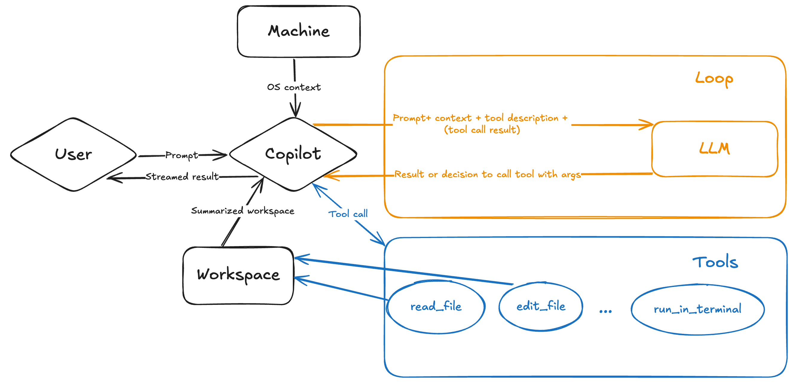

# Bonus content

| [← Add the filter feature][walkthrough-previous] | [Next: Pets workshop selection →][walkthrough-next] |
|:-----------------------------------|------------------------------------------:|

## Overview of Copilot Agent Mode

With chat agent mode in Visual Studio Code, you can use natural language to define a high-level task and to start an agentic code editing session to accomplish that task. In agent mode, Copilot **autonomously** plans the work needed and determines the relevant files and context. It then makes edits to your codebase and invokes tools to accomplish the request you made. Agent mode monitors the outcome of edits and tools and iterates to resolve any issues that arise.

> [!IMPORTANT]
> While Copilot autonomously determines the operations necessary to complete the requested task, as the developer you are always in charge. You will work with Copilot to ensure everything is completely correctly, reading and reviewing the code. You will also want to continue to follow proper DevOps practices, including code reviews, testing, security scans, etc.

Why would you use agent mode instead of edit mode?

- **Edit scope**: agent mode autonomously determines the relevant context and files to edit. In edit mode, you need to specify the context yourself.
- **Task complexity**: agent mode is better suited for complex tasks that require not only code edits but also the invocation of tools and terminal commands.
- **Duration**: agent mode involves multiple steps to process a request, so it might take longer to get a response. For example, to determine the relevant context and files to edit, determine the plan of action, and more.
- **Self-healing**: agent mode evaluates the outcome of the generated edits and might iterate multiple times to resolve intermediate issues.
- **Request quota**: in agent mode, depending on the complexity of the task, one prompt might result in many requests to the backend.

### How it works

## Add themes to the Tailspin Shelter website

In this section, you will use Copilot's agent mode to add themes to the Tailspin Shelter website. You will be able to select a theme and apply it to the website.

1. Return to your IDE with the project open.
2. Close any tabs you may have open in your IDE to ensure the context for Copilot chat is empty.
3. Select the `+` icon towards the top of Copilot chat to begin a new chat.
4. Select agent mode, by selecting `Agent` (just like you did `Edit` before) in the model selector dropdown at the bottom of the chat window.
5. Select one of models (some may not be available) `Claude 3.7 Sonnet`, `Claude 3.5 Sonnet` or `GPT-4.1 (Preview)`
6. Navigate to 
7. Copy the content of the prompt
8. Paste the content in the copilot prompt input
9. The agent mode will take its time, since it searches by itself the relevant files to modify, and then do multiple passes including talking with itself to refine the task at hand
10. While Agent is doing it's thing, take the opportunity to examine the content of prompt that was used.
11. When the agent is done (you no longer see any spinners and the thumb up/down icons will be visible), open a browser to see the results
    - Open the page at [http://localhost:4321][tailspin-shelter-website] to see the updates!
    - Examine the changes made to the files if you like
    - Was it good? If you are not happy with the results, you can refine the prompt by crafting extra prompts in the chat to improve the end results. Don't start a new session, it's an interactive process.
12. Press `Done` when you are happy with the results

You _may_ have gotten something like this for the Terminal Theme (generated with claude 3.7)

> [!IMPORTANT]
> Because LLMs are probabilistic, not deterministic, the exact code generated can vary. The above is a representative example. If your code is different, that's just fine as long as it works!

## Play a bit with Copilot

You've made it to the end of the one hour workshop. Congratulations! You've explored the core skills to help you get the most out of GitHub Copilot. From here you can explore various challenges on your own, and see how GitHub Copilot can support you as you continue developing.

The suggestions listed here are exactly that - suggestions. You're free to come up with your own scenarios or features you think the application should have.

You'll also notice there aren't step-by-step instructions here. You've already seen how you can use Copilot to aid you in development. Part of the challenge put forth with these extra suggestions is to apply what you've learned to create code!

### Some prompts to play with

We have provided you some prompts in [prompts][github-prompts-path] folder, which you can use directly as inspiration for your explorations.

> [!TIP]
> These prompts are meant to be used as one shot, but if have prompts that can be are generic, reusable prompt are a great way to share prompts with the team members. They can be placed in a well know folder and be invoked directly in the Copilot Chat by referencing them.
> Learn more about [reusable prompts in Visual Studio Code][vscode-prompts]

### Potential next steps

Here's some ideas of how you could continue to grow and build upon what you've done:

- Return to the API endpoints you updated previously in Flask and add unit tests.
- Add paging support to the full list of dogs or any results page with more than 5 results.
- Add a form to allow a user to apply to adopt a dog if the dog is available.
- Add a form to allow users to register a dog they found.

| [← Add the filter feature][walkthrough-previous] | [Next: Pets workshop selection →][walkthrough-next] |
|:-----------------------------------|------------------------------------------:|

[walkthrough-previous]: ./4-add-feature.md
[walkthrough-next]: ../README.md
[tailspin-shelter-website]: http://localhost:4321
[github-prompts-path]: ../prompts/
[vscode-prompts]: https://aka.ms/vscode-ghcp-prompt-snippets